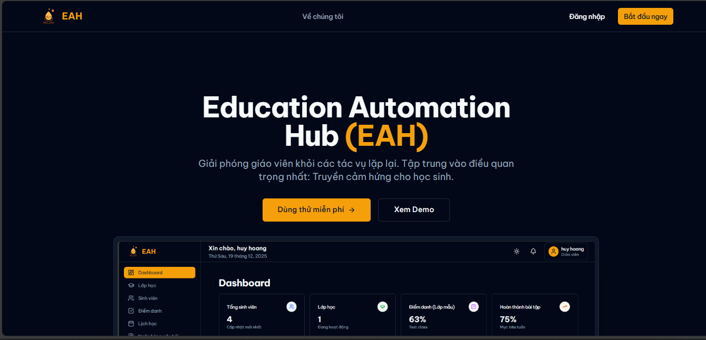
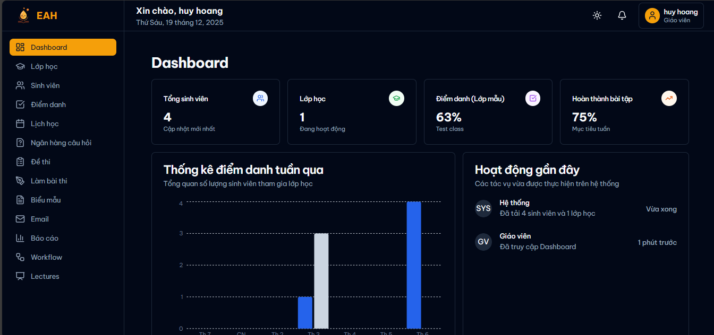
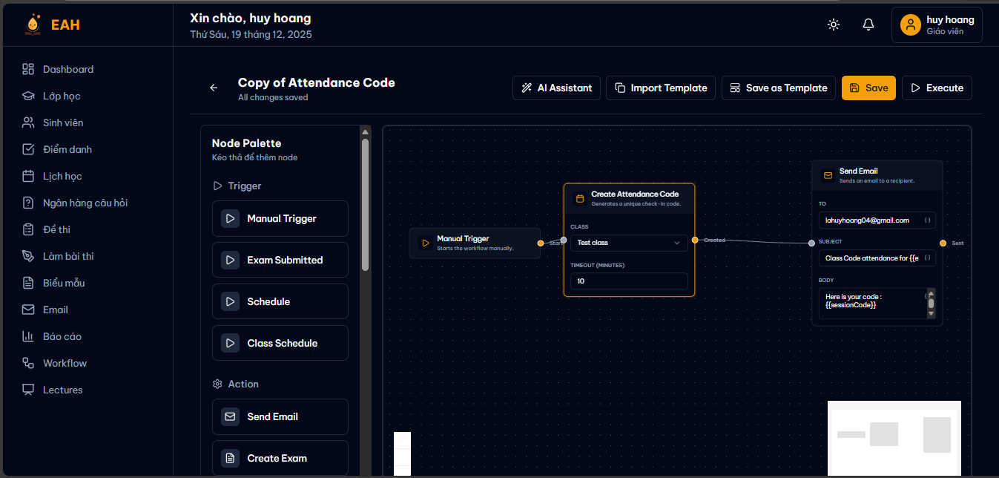
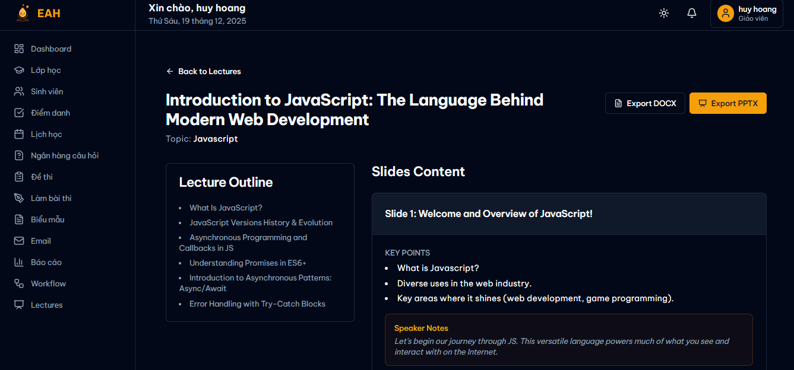

# 🌞 Automation Education Hub - Teacher Automation System 🌞

<div align="center">


[](https://nextjs.org/)
[](https://nestjs.com/)
[](https://fastapi.tiangolo.com/)
[](https://www.postgresql.org/)
[](https://azure.microsoft.com/en-us/products/phi)

<p align="center">
  <strong>Automate your teaching workflow with the power of AI and drag-and-drop simplicity.</strong>
  <br />
  <br />
  <a href="#-getting-started">Getting Started</a>
  ·
  <a href="#-features">Features</a>
  ·
  <a href="#-tech-stack">Tech Stack</a>
  ·
  <a href="#-documentation">Docs</a>
</p>

</div>

---

## 📖 About The Project

**EAH** is a comprehensive system designed to revolutionize how teachers manage their daily tasks. By combining a intuitive drag-and-drop workflow builder with powerful AI integration, we automate everything from attendance tracking to content generation.

### Why EAH?
*   **Save Time:** Automate repetitive tasks like grading and emailing.
*   **AI-Powered:** Generate lesson plans, quizzes, and slides in seconds using self-hosted **Phi-3**.
*   **Flexible:** Design your own automation flows visually.

---

## 📸 Product Screenshots

<div align="center">
  <!-- HOMEPAGE -->
  
  <br>
  <em>The Landing Page - Modern and accessible interface for all users.</em>
</div>

<br>

<div align="center">
  <!-- PRIMARY SCREENSHOT -->
  
  <br>
  <em>The Main Dashboard - Overview of all classes and active workflows.</em>
</div>

<br>

<div align="center" style="display: flex; gap: 10px; justify-content: center;">
  <!-- SECONDARY SCREENSHOTS -->
  
  
</div>

*(Demonstration of key features)*

---

## ✨ Features

| Category | Features |
|----------|----------|
| **🏃‍♂️ Automation** | • **Drag-and-drop workflow builder** <br> • Automated Email (Gmail API) <br> • Conditional logic & Triggers |
| **📚 Academic** | • **Class & Student Management** <br> • Attendance Tracking <br> • Automated Grading & Reports |
| **🤖 AI Power** | • **Content Generation** (PPTX, DOC, Video) <br> • AI-assisted Grading <br> • Powered by **Phi-3 (Self-hosted)** |
| **📝 Tools** | • **Question Bank** & Exam Management <br> • Forms & Surveys <br> • Analytics Dashboard |

---

## 🛠️ Tech Stack

### 🖥️ Frontend
*   **Framework**: Next.js 14 (App Router)
*   **UI Library**: shadcn/ui, Tailwind CSS
*   **State Management**: Zustand
*   **Diagramming**: React Flow

### ⚙️ Main Backend
*   **Framework**: NestJS
*   **Language**: TypeScript
*   **Database**: PostgreSQL (TypeORM)
*   **Queue**: BullMQ + Redis
*   **Auth**: Passport.js

### 🧠 AI Content Service
*   **Framework**: FastAPI (Python)
*   **AI Model**: Microsoft Phi-3 (Self-hosted via Ollama/vLLM)
*   **Tools**: python-pptx, Celery

---

## 🚀 Getting Started

### Prerequisites

*   **Node.js** 18+
*   **Python** 3.10+
*   **PostgreSQL** 14+
*   **Redis** 7+
*   Cloud Accounts: Google Cloud (OAuth, Gmail), Cloudinary.
*   **Ollama** (for running Phi-3 locally)

### Configuration (`.env`)

1.  Copy `.env.example` to `.env` in each service folder.
2.  Populate the required keys:

```env
# Google Cloud
GOOGLE_CLIENT_ID=...
GOOGLE_CLIENT_SECRET=...
# AI Service (Ollama)
OLLAMA_BASE_URL=http://ollama:11434

# Cloudinary
CLOUDINARY_CLOUD_NAME=...
CLOUDINARY_API_KEY=...
```

### ⚡ Installation

#### Docker (Recommended)

The project is configured to run in **Production Mode** for best performance.

1. **Start all services:**
   ```bash
   docker-compose up --build -d
   ```

2. **Initialize AI Model (One-time setup):**
   This downloads the Microsoft Phi-3 model to your local Ollama instance (approx 2.4GB).
   ```bash
   docker-compose exec ollama ollama pull phi3
   ```

#### Manual Setup

**1. Frontend (Port 3000)**
```bash
cd frontend
npm install
npm run dev
```

**2. Main Backend (Port 4000)**
```bash
cd services/main-backend
npm install
npm run start:dev
```

**3. AI Service (Port 8000)**
```bash
cd services/ai-content
pip install -r requirements.txt
uvicorn app.main:app --reload
```

---

## 📝 License

**Non-Commercial Use Only.**

This project is licensed under a custom Non-Commercial License. You are free to use it for educational and personal purposes.
**Commercial use is strictly prohibited without prior written permission.**

See `LICENSE` for more information.

[](./LICENSE)
